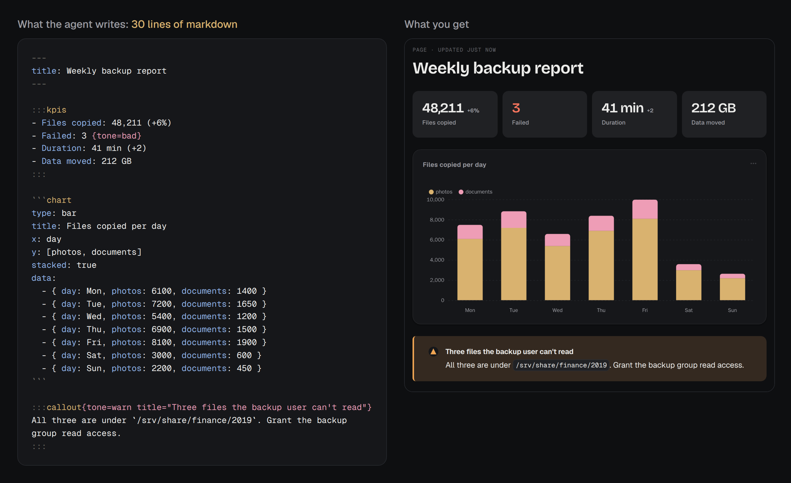

# Indy

**Drop-in, universal, feature-rich artifacts for agents.**

Agents publish pages to Indy and hand you a link. You read, tick, edit, or comment, then send it
back. Works with any MCP agent, self-hosted in one container.

<p align="center">
  <a href="#features"><b>Features</b></a> ·
  <a href="#indy-vs-claude-artifacts"><b>Indy vs Claude artifacts</b></a> ·
  <a href="#benchmarks"><b>Benchmarks</b></a> ·
  <a href="#docs"><b>Docs</b></a>
</p>

<p align="center">
  
</p>

## Quick install

```bash
curl -fsSLO https://raw.githubusercontent.com/liamdmcgarrigle/indy-artifacts/main/compose.yaml
docker compose up -d
# open http://localhost:1936, create your account, and the Connect page walks your agent through the rest
```

## Features

**Pages that are cheap for an agent to write**

- Markdown with number tiles, cards, callouts, tabs, columns, timelines, and verdict badges
- Charts, sortable tables, and Mermaid diagrams from short fenced blocks
- React in TSX (with Tailwind and shadcn/ui), Svelte, or plain HTML, compiled and sandboxed
- Your project's real components, drawn from its Storybook build
- A saved theme per project, dark mode, and pages that work on a phone

**Pages people use**

- Checklists that show who ticked each item and when
- Forms and multiple-choice questions the agent reads back
- Comments pinned to the exact words or element they are about
- A Send button that delivers your comments to the agent, or the agent waits on the page and
  picks them up as they arrive
- Editing in place for text, number tiles, chart data, and form questions, with other people's
  carets shown live
- The agent can type into the page while you watch

**History and sharing**

- Every version is kept, and you or the agent can diff any two
- Pages are private until you share them, by open link or by email code
- Visitors give their name before they comment or tick, and agents treat what they write as
  untrusted until you say otherwise
- Agents can make share links too, if you turn that on

**Yours to run**

- One container, one port, one volume, and one SQLite file
- OAuth sign-in for agents, with a token per agent that you can revoke on its own
- A library grouped by project and branch, with search and a command palette
- Free software under the AGPL

## Indy vs Claude artifacts

Claude Code and claude.ai publish artifacts of their own. Indy is built for handing a page to a
person and getting their answer back, from any agent. Claude's artifacts do more as standalone
apps inside Anthropic's platform, where a page can call Claude and your connectors.

**3× faster, 54% cheaper, 64% fewer tokens, and 100% less lock-in.** ([benchmarks](#benchmarks))

| | Indy | Claude artifacts |
|---|---|---|
| **Agents** | | |
| Works with Claude Code | ✅ | ✅ |
| Works with Codex and other MCP clients | ✅ | ❌ |
| Pages written as markdown blocks | ✅ | ❌ HTML only |
| Agent reads comments back | ✅ | ✅ |
| Agent waits for the next comment, tick, or answer | ✅ `artifact_wait` | ✅ watch, while the session is open |
| Agent sees what changed between versions | ✅ `artifact_diff` | ❌ |
| Agent types into a page while you watch | ✅ | ❌ |
| **Page content** | | |
| Charts, tables, callouts, and number tiles without writing code | ✅ | ❌ hand-written in HTML |
| Mermaid diagrams | ✅ | ✅ |
| Native React components in TSX, compiled from a file map | ✅ | ❌ one HTML file, React from a CDN |
| Native Svelte components | ✅ | ❌ |
| Storybook integration: your project's real components on the page | ✅ | ❌ |
| Saved themes per project | ✅ | ⚠️ design systems, for decks and designs |
| Slides, docs, and design canvases as ready-made types | ❌ | ✅ |
| **People on the page** | | |
| Checklists that save ticks | ✅ built in, with names | ⚠️ the agent has to code it (`artifact` or `db` capability) |
| Forms the agent reads back | ✅ built in | ⚠️ the agent has to code it (`db` capability) |
| Comments pinned to text or elements | ✅ | ✅ |
| Edit the page in place | ✅ | ❌ |
| Live co-editing with others' carets | ✅ | ⚠️ via the `room` capability, if the agent builds it |
| Page calls Claude or your connectors | ❌ | ✅ `sample` and `mcp` capabilities |
| Version history and compare | ✅ | ⚠️ history, no compare |
| **Sharing** | | |
| Private by default | ✅ | ✅ |
| Share link open to anyone | ✅ | ✅ |
| Share link gated by an email code | ✅ | ❌ |
| Visitors comment without an account | ✅ with a name | ❌ |
| Agent makes share links, with limits you set | ✅ opt-in | ❌ |
| **Running it** | | |
| Where it runs | your server | Anthropic |
| Works across agents and accounts | ✅ | ❌ one Claude account |
| Your data stays on your machine | ✅ | ❌ |
| Source available | ✅ AGPL | ❌ |

## Benchmarks

Claude Code made the same pages with Indy and with Claude's own Artifact tool, three times each
(medians, Claude Opus 5.5, Indy first):

| page | output tokens | cost | time |
|---|---:|---:|---:|
| Report with number tiles, a chart, a table, and a callout | 2,175 vs 7,595 | $0.30 vs $0.51 | 20 s vs 66 s |
| A revision to that report | 3,921 vs 9,285 | $0.41 vs $0.60 | 15 s vs 18 s |
| Checklist and form, saved and read back | 1,483 vs 6,243 | $0.11 vs $0.62 | 16 s vs 59 s |
| Large page: nine charts, tables, a timeline, and a diagram | 13,361 vs 36,528 | $0.72 vs $1.42 | 94 s vs 292 s |
| The same large page with a form at the end | 13,847 vs 38,324 | $0.74 vs $1.78 | 97 s vs 322 s |

The prompts, the runner, and every run's numbers are in [`docs/benchmarks.md`](docs/benchmarks.md).

### Why it's lighter

With Claude's Artifact tool, the agent writes every page from scratch: the HTML, the CSS for light
and dark, and the chart code. With Indy it writes short markdown blocks and Indy draws the
components. This is the whole source of a page, and the page Indy draws from it:

<p align="center">
  
</p>

For the report in the benchmark, the agent wrote 2,165 characters of markdown with Indy and 11,660
characters of HTML with the Claude Artifact tool.

## Docs

### Install

You need Docker (or Podman) with Compose, and a machine that stays on.

```bash
mkdir indy && cd indy
curl -fsSLO https://raw.githubusercontent.com/liamdmcgarrigle/indy-artifacts/main/compose.yaml
curl -fsSL https://raw.githubusercontent.com/liamdmcgarrigle/indy-artifacts/main/.env.example -o .env
```

Set `INDY_URL` in `.env` to the address you will open Indy at, such as `http://192.168.1.20:1936`
on a home network or `https://indy.example.com` on a server. Then run `docker compose up -d`.

Open `INDY_URL` and create your account. Until you do, anyone who can reach the address can
create it, so do it right after the first start. If someone beats you to it, start over:

```bash
docker compose down
docker volume rm indy_indy-data
docker compose up -d
```

This keeps Caddy's certificates, so a reinstall doesn't count against Let's Encrypt's limits.

### Connect an agent

Setup ends on the Connect page (`<INDY_URL>/connect`), which walks you through this with your
address filled in and shows when the agent reaches Indy.

Agents connect over MCP at `<INDY_URL>/mcp` and sign in with OAuth in the browser, so nothing
needs copying. For Claude Code:

```bash
claude mcp add --transport http --scope user indy https://indy.example.com/mcp
# then in Claude Code: /mcp, pick indy, Authenticate
```

For Codex, which starts the sign-in by itself:

```bash
codex mcp add indy --url https://indy.example.com/mcp
```

Claude Code only signs in this way over HTTPS. On plain HTTP, or on a machine with no browser,
make a token on the Connect page and pass it as a header. Settings › Agents lists every connected
agent and disconnects any of them.

The optional plugin adds four skills (`publish` for making pages, `charts` for picking the
right chart, `storybook` for showing a project's components, and `feedback` for picking up your
comments) and tells the agent Indy is there at the start of each session:

```bash
claude plugin marketplace add liamdmcgarrigle/indy-artifacts && claude plugin install indy@indy
codex plugin marketplace add liamdmcgarrigle/indy-artifacts && codex plugin add indy@indy
```

Any other MCP client can use `<INDY_URL>/mcp` over streamable HTTP, with OAuth or an
`Authorization: Bearer` token. claude.ai and Claude Desktop can add it as a custom connector when
Indy is on a public HTTPS address. The server serves its block reference as `indy://reference`,
so an agent can learn the format without the plugin.

### HTTPS

Anything reachable from the internet should be on HTTPS, since sign-in cookies are only marked
Secure when `INDY_URL` starts with `https://`. On a tailnet or a home network, plain HTTP is fine.

To use the bundled Caddy, point a domain at the server, open ports 80 and 443, add this to
`.env`, and start with `docker compose --profile https up -d`. Caddy gets and renews the
certificate.

```bash
INDY_URL=https://indy.example.com
INDY_DOMAIN=indy.example.com
INDY_BIND=127.0.0.1
INDY_PROXY_HOPS=1
```

With your own proxy, forward everything to port 1936 and set `INDY_PROXY_HOPS=1`. The proxy has
to pass websockets on `/collab` and must not buffer `/api/live`. Traefik does both by default.
For nginx:

```nginx
location / {
    proxy_pass http://127.0.0.1:1936;
    proxy_http_version 1.1;
    proxy_set_header Host $host;
    proxy_set_header X-Forwarded-Proto $scheme;
    proxy_set_header X-Forwarded-For $proxy_add_x_forwarded_for;
    proxy_set_header Upgrade $http_upgrade;
    proxy_set_header Connection $connection_upgrade;
    proxy_buffering off;
    proxy_read_timeout 1h;
}
```

### Settings

Everything is an environment variable in `.env`. Only `INDY_URL` is required.

| Variable | Default | What it does |
|---|---|---|
| `INDY_URL` | `http://localhost:1936` | The address people open Indy at. Share links, agent snippets, and cookies are built from it. |
| `INDY_PORT` | `1936` | The host port. |
| `INDY_BIND` | `0.0.0.0` | The host address the port is published on. Use `127.0.0.1` behind a proxy. |
| `INDY_DOMAIN` | | The domain Caddy gets a certificate for, with `--profile https`. |
| `RESEND_API_KEY` | | Turns on email through [Resend](https://resend.com). See below. |
| `INDY_EMAIL_FROM` | `Indy <onboarding@resend.dev>` | The sender for emails. |
| `INDY_AUTH` | `password` | `local` skips sign-in and treats every request as you. Only for an install nobody else can reach. |
| `INDY_ASSET_ROOTS` | | Colon-separated folders a page may load images from by absolute path. Each must also be mounted into the container. |
| `INDY_PROXY_HOPS` | `0` | How many reverse proxies sit in front of Indy. Set `1` behind one (the bundled Caddy included), so sign-in limits count each visitor separately. |
| `INDY_IMAGE` | `ghcr.io/liamdmcgarrigle/indy-artifacts:latest` | The image to run. Pin a release such as `:1.2` to update on your own schedule. |

Any of these can be read from a file, the way Docker and Swarm mount secrets: set
`RESEND_API_KEY_FILE=/run/secrets/resend_api_key` instead of `RESEND_API_KEY`. The plain variable
wins when both are set. Older `ARTIFACTS_*` names still work when their `INDY_*` name is unset.

For anything compose doesn't expose, such as mounting a folder for `INDY_ASSET_ROOTS`, use a
`compose.override.yaml` next to `compose.yaml`. `compose.override.example.yaml` shows the shape.

### Email

Email is optional. It turns on two things: a sign-in code after your password, and share links
that ask visitors to confirm their email. Set `RESEND_API_KEY` for both. Resend's shared test
sender only delivers to your own Resend address, which covers sign-in codes. To email visitors,
verify a domain with Resend and set `INDY_EMAIL_FROM` to an address on it.

### Storage and images

Indy caps its disk use at 5 GB by default. At the cap, agents can't publish or update pages and
are told why, while reading, comments, and sharing keep working. Settings › Data raises or
removes the cap and shows what is using the space.

Attached images are scaled to fit 2560 px, re-encoded at quality 80 in their own format, and
stripped of EXIF data. GIFs and SVGs are stored as they are. Settings › Data changes this or turns
it off, for images attached afterwards.

### Updating and backups

```bash
docker compose pull
docker compose up -d
```

Updates leave the `indy-data` volume alone and apply database changes on start. That volume holds
everything: one SQLite database plus uploaded assets. To back it up, stop Indy for a moment so the
database is consistent:

```bash
docker compose stop indy
docker run --rm -v indy_indy-data:/data:ro -v "$PWD":/backup alpine \
  tar czf /backup/indy-$(date +%F).tgz -C /data .
docker compose start indy
```

To restore into a fresh install, before its first start:

```bash
docker volume create indy_indy-data
docker run --rm -v indy_indy-data:/data -v "$PWD":/backup alpine \
  sh -c "tar xzf /backup/indy-2026-09-26.tgz -C /data && chown -R 1000:1000 /data"
docker compose up -d
```

### Building the image yourself

```bash
git clone https://github.com/liamdmcgarrigle/indy-artifacts
cd indy-artifacts
docker build -t indy:local .
```

Then set `INDY_IMAGE=indy:local` in `.env`. Published images are built for `linux/amd64` and
`linux/arm64`. `:latest` follows `main`, and each version also gets its own tags.

### Pages

A page has a stable address and a list of versions that never change once written. There are
four kinds:

| kind | the agent sends | shown as |
|---|---|---|
| `markdown` | one markdown document with frontmatter | the page itself, with HTML and Mermaid blocks in sandboxed frames |
| `react` | a map of files with `App.tsx` | compiled with esbuild, run in a sandboxed frame |
| `svelte` | a map of files with `App.svelte` | the same, through the Svelte 5 compiler |
| `html` | one complete HTML document | a sandboxed frame |

Markdown is the cheap path; [Why it's lighter](#why-its-lighter) shows a whole page. The full
set is `:::card`, `:::callout`, `:::kpis`, `:::columns` with `:::col`, `:::tabs` with `:::tab`,
`:::details`, the form blocks `::field` and `:::choice` with `:::option`, and the
fences `chart`, `table`, `mermaid`, `html`, and `story`. The reference is
`plugin/skills/publish/reference.md`, the same text MCP serves as `indy://reference`.

### Themes

A theme is twenty settings: ten colors, four fonts, text size, line height, corner radius,
shadow, spacing, and reading width. Indy derives the rest, including hover colors, chart colors,
and the dark scheme, and you can override any dark color by hand.

Pages use their project's theme, and projects without one use the default. Settings › Themes
edits themes with a light and dark preview, and has three built-ins (Paper, Graphite, and Sand)
to use or copy. Agents can create themes and assign them to projects with `artifact_theme_set`,
which the publish skill uses to match a project's look. Only you can delete a theme or pick the
default. Indy serves its own fonts, so pages make no requests to a font CDN.

### Storybooks

If a project has a Storybook, a page can show its stories drawn by the real, compiled
components: screens at device size, a component with different props, or a form asking which of
two designs to ship.

The agent builds the Storybook and uploads it over HTTP: `artifact_storybook_upload` gives it a
single-use address to send the build to with `tar` and `curl`. A page then names stories with a
`story` fence:

````markdown
```story
id: screens-friends--requests
width: 402
height: 874
```
````

Each page version keeps the build it was published with, so a design review keeps showing what
was reviewed. Files are stored once by content, so a new build costs only what changed. Indy keeps
the three newest builds of each Storybook plus any build a page still shows. Settings ›
Storybooks lists and deletes them. A Storybook can map its globals to Indy's light and dark
schemes, and list the hosts its stories may load images, fonts, and styles from. For CI,
`POST /api/storybooks/<name>/builds` with an agent token and the gzipped tar does the same as the
upload tool.

### Security

There is one account. Each agent gets its own token, revocable on its own.

Anything an agent wrote that can run goes in an `<iframe sandbox="allow-scripts">` without
`allow-same-origin`, so it has no cookies, no storage, and no access to the page around it, and a
Content Security Policy blocks its network access. Markdown is sanitized. Compiled apps may import
react, react-dom, svelte, chart.js, d3, lucide-react, shadcn/ui and the packages it is built on,
and their own files; any other import fails the build and the error goes back to the agent.

A Storybook build runs in the same kind of frame, loading only its own files plus images, fonts,
and styles from hosts you allowed. It can't call Indy's API or any other site. Anyone who can
open a page showing one story can load that whole build, so think before sharing a page from a
private project.

A visitor on a share link sees only that page and the comments made through that link. They see
the names (never the emails) of everyone who ticked. Their comments reach agents marked
untrusted and `needs_operator_ok`, so the agent asks you before acting, until you click "Ask
agent to address". Their form answers wait for you.

Only you create share links, unless you turn on "Agents may create share links" under Settings ›
Shared links. With it on, an agent can share a page after you ask it to, by typing the slug a
second time and giving a reason that restates your request. Its links expire within 30 days (7 by
default), show the version current when made unless it asks to follow later ones, and take no
comments unless it turns them on. The Share dialog shows which agent made each link and why. No
MCP tool changes the setting, and agents can't change or revoke your links. With
`INDY_AUTH=local`, anything that can reach Indy counts as you, so there the setting only guards
against mistakes.

### Working on Indy

```bash
docker compose -f compose.dev.yaml up   # hot reload on port 5178, data in ./data
npm ci && npm test && npm run typecheck
```

`app/` is the Next.js server, viewer, API, and MCP endpoint. `collab/` is the live-editing
server. `packages/primitives` holds the `<art-*>` elements pages are built from. `plugin/` is the
Claude Code and Codex plugin, and `tools/` a Playwright screenshot harness.

To release, run `npm run set-version 0.3.0`, which writes the version into `VERSION`, the package
manifests, and both plugin manifests, then merge to `main`. The first build of a new version
publishes `:0.3.0`, `:0.3`, and `:0`, tags `v0.3.0`, and writes a GitHub release. Bump it for
every plugin change too, since Claude Code only offers a plugin update when the version changes.

## Contributing

Issues are welcome. Pull requests are closed unless they come out of an issue discussion first.
See [CONTRIBUTING.md](CONTRIBUTING.md).

## License

Indy is free software under the [GNU Affero General Public License v3.0](LICENSE) or any later
version. If you run a modified Indy that other people use over a network, you have to offer them
the source of your version too.
