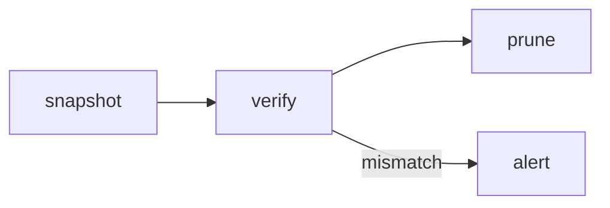

# Artifacts authoring reference

Everything you can put in an artifact, with one example of each.

## The four kinds

| kind | you send | rendered as |
|---|---|---|
| `markdown` | `source`: one markdown document with YAML frontmatter | the vocabulary below; `html` and `mermaid` blocks go in sandboxed frames |
| `react` | `files`: a map of paths to contents, entry `App.tsx` with a default export | bundled at publish, runs in one sandboxed frame |
| `svelte` | `files`: same shape, entry `App.svelte` | bundled at publish, runs in one sandboxed frame |
| `html` | `source`: one complete HTML document | one sandboxed frame, served as-is under a strict CSP |

Markdown covers most reports. Use `react` or `svelte` when the page needs state or
interaction beyond tabs, and `html` when you already have a finished document.

## Frontmatter (markdown kind)

```yaml
---
title: Backup run 2026-09-20      # required
theme: backup-studio              # default | picaflick | backup-studio (default: default)
project: backup-studio            # optional grouping label in the index
description: Nightly run summary  # optional one-liner in the index
tags: [backup, nightly]           # optional
---
```

For the other kinds the same fields are tool arguments instead.

## Container directives

Syntax is `:::name{attr="value"}` on its own line, content, then `:::` to close. Write
three colons at every level when you nest them: a card can hold columns that hold
charts, and each opener takes its own `:::` closer, innermost first. A directive body is
parsed as markdown. A container you never close comes back in `warnings` with its line
number.

### `:::card{title, subtitle}`

```md
:::card{title="Restore check" subtitle="weekly, sampled"}
Three of 412 archives were sampled and restored. All three matched their manifest.
:::
```

### `:::callout{tone, title}`

`tone` is `info` (the default), `good`, `warn` or `bad`.

```md
:::callout{tone="warn" title="Retention drifting"}
The 90-day policy is holding 104 days of snapshots. Nothing is at risk yet.
:::
```

### `:::kpis`

The body is a bullet list of `Label: value`. A bullet may carry a `{tone=...}` and end
with a delta in parentheses.

```md
:::kpis
- Archives: 412
- Restored: 3 {tone=good} (+1)
- Failed: 0 {tone=good}
- Duration: 41m (-6m)
:::
```

### `:::columns{n}` with `:::col`

`n` is 2 to 4, default 2.

```md
:::columns{n="2"}
:::col
**Before**: 41 minutes, 12 GB transferred.
:::
:::col
**After**: 35 minutes, 9 GB transferred.
:::
:::
```

### `:::tabs` with `:::tab{label}`

```md
:::tabs
:::tab{label="Summary"}
All 412 archives verified.
:::
:::tab{label="Log"}
See `assets/run.txt` for the full output.
:::
:::
```

### `:::details{summary}`

```md
:::details{summary="Full command"}
`restic -r /srv/backups check --read-data-subset=3%`
:::
```

## Fenced blocks

### ```` ```chart ````

YAML. `type` is `bar`, `line`, `area`, `pie`, `doughnut` or `scatter`. `x` is one key,
`y` is a key or a list of keys, `data` is a list of objects. Optional: `title`,
`stacked` (bool), `unit` (a suffix on values), `height` (px, default 280). Colours come
from the theme.

````md
```chart
type: bar
title: Backup duration by night
x: night
y: [full, incremental]
stacked: true
unit: min
height: 320
data:
  - { night: Mon, full: 41, incremental: 6 }
  - { night: Tue, full: 0, incremental: 7 }
  - { night: Wed, full: 0, incremental: 5 }
```
````

### ```` ```table ````

CSV with a header row. An optional first line `# sortable` makes the columns sortable.

````md
```table
# sortable
Repository,Archives,Last check,Status
srv-backups,412,2026-09-20,ok
photos,88,2026-09-19,ok
```
````

The YAML form does the same job when a value contains commas:

````md
```table
columns: [Repository, Archives, Status]
rows:
  - [srv-backups, 412, ok]
  - [photos, 88, ok]
```
````

### ```` ```mermaid ````

Rendered in a sandboxed frame from the vendored mermaid build.

````md

````

### ```` ```html ````

The escape hatch. Raw HTML written inline in markdown is stripped by the sanitizer; this
fence is the only way to get your own markup onto the page.

````md
```html
<div style="display:flex;gap:8px">
  <span style="padding:2px 8px;border-radius:999px;background:#E3E8D6">verified</span>
  <span style="padding:2px 8px;border-radius:999px;background:#F0DDD9">stale</span>
</div>
```
````

## Sandboxing, and what it costs you

`html` and `mermaid` blocks, and the `react`, `svelte` and `html` kinds, render inside an
iframe with no same-origin access and no network. A CDN script, a web font or a `fetch`
call will not load; the frame gets the theme CSS and nothing else. Anything a page needs
has to be in the source you send or vendored in the server.

For `react` and `svelte` the only importable packages are `react`, `react-dom`,
`react-dom/client`, `svelte`, `svelte/store`, `chart.js`, `chart.js/auto`, `d3`,
`lucide-react` and relative files inside your own `files` map. Any other import fails the
build and the error names it. The entry is `App.tsx` (default-exported component) or
`App.svelte`; the server mounts it for you, so do not write your own `createRoot` or
`mount` call.

```
files: {
  "App.tsx": "import Report from './Report'\nexport default function App() { return <Report /> }",
  "Report.tsx": "export default function Report() { return <h1>Backup run</h1> }"
}
```

A build failure still creates the version, with `build_status: "error"` and the compiler
log in `build_log`, so the operator can see what happened and you can read it back.

## Assets

Attach a file by absolute host path, not by pasting bytes:

```
assets: [{ name: "run-chart.png", path: "/home/liam/work/backup-studio/out/chart.png" }]
```

The path must be under `/home/liam/work`, `/home/liam/orca` or `/tmp`. Reference it from
markdown as `assets/run-chart.png`. Assets carry forward: an update that omits `assets`
keeps the previous version's set. Names match `[A-Za-z0-9._-]{1,80}`, and the allowed
extensions are `png jpg jpeg gif webp svg mp4 webm json csv txt`.

## Limits

| limit | value |
|---|---|
| `source` | 1 MB |
| `files` map | 40 files, 2 MB total |
| asset | 20 MB each, 30 per version |
| build | 20 s, output 5 MB |
| comment body | 20 KB |
| `artifacts_wait` | 55 s |

A block that fails to parse does not fail the publish: it renders an error box on the
page and comes back in `warnings` with a line number.
