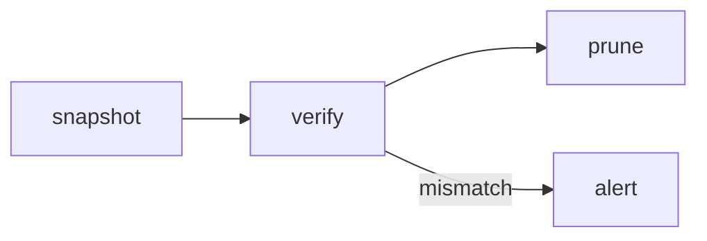

# Indy authoring reference

Everything you can put in an artifact, with one example of each.

## The four kinds

| kind | you send | rendered as |
|---|---|---|
| `markdown` | `source`: one markdown document with YAML frontmatter | the vocabulary below; `html` and `mermaid` blocks go in sandboxed frames |
| `react` | `files`: a map of paths to contents, entry `App.tsx` with a default export | bundled at publish, runs in one sandboxed frame |
| `svelte` | `files`: same shape, entry `App.svelte` | bundled at publish, runs in one sandboxed frame |
| `html` | `source`: one complete HTML document | one sandboxed frame, served as-is under a strict CSP |

Markdown covers most reports. Use `react` or `svelte` when the page needs state or
interaction beyond tabs, and `html` when you already have a finished document.

## Frontmatter (markdown kind)

```yaml
---
title: Backup run 2026-09-20      # required
project: nightly-backups          # the repository's folder name; also picks the page's theme
theme: graphite                   # optional; leave it out to follow the project's theme
description: Nightly run summary  # optional one-liner in the index
tags: [backup, nightly]           # optional
---
```

For the other kinds the same fields are tool arguments instead.

## Themes

A page takes its theme from its project, unless it names one with `theme`, and the
project's comes from Indy's default unless one was set. So set a theme on the project once
rather than on each page. `artifact_themes` lists the themes and which project uses which.

`artifact_theme_set` creates or changes a theme and can make it a project's theme:

```
artifact_theme_set
  name:     "acme-web"
  label:    "Acme"
  base:     "paper"                    # paper | graphite | indy, or one of yours; creating only
  tokens:   { accent: "#e4572e", background: "#fbfaf8", surface: "#ffffff",
              text: "#1d1b19", muted: "#6b665f", border: "#e8e3dc",
              fontSans: "manrope", fontBody: "source-serif", radius: 6 }
  projects: ["acme-web"]
```

The settings are ten colours (`background`, `surface`, `text`, `muted`, `border`,
`accent`, `info`, `good`, `warn`, `bad`, all hex), four fonts (`fontSans`, `fontDisplay`,
`fontBody`, `fontMono`), `fontSize` (px), `lineHeight`, `radius` (px), `shadow` (`none`,
`soft`, `lifted`), `density` (`compact`, `normal`, `airy`) and `measure` (reading width in
ch). When creating, anything left out comes from `base`; when changing a theme, only what
you pass changes, and `base` is refused. Everything else, including hovers, washes, chart
colours and the whole dark scheme, is derived; `dark: { background: "#101010" }` sets a
dark colour where the derived one is wrong. Fonts are the ones Indy serves: `inter`,
`geist`, `manrope`, `nunito-sans`, `bricolage`, `source-serif`, `jetbrains-mono`,
`geist-mono` and the `system-sans`, `system-serif` and `system-mono` stacks. The built-in
themes cannot be changed; copy one by passing it as `base` under a new name.

## Container directives

Syntax is `:::name{attr="value"}` on its own line, content, then `:::` to close. Write
three colons at every level when you nest them: a card can hold columns that hold
charts, and each opener takes its own `:::` closer, innermost first. A directive body is
parsed as markdown. A container you never close comes back in `warnings` with its line
number.

### `:::card{title, subtitle}`

```md
:::card{title="Restore check" subtitle="weekly, sampled"}
Three of 412 archives were sampled and restored. All three matched their manifest.
:::
```

### `:::callout{tone, title}`

`tone` is `info` (the default), `good`, `warn` or `bad`.

```md
:::callout{tone="warn" title="Retention drifting"}
The 90-day policy is holding 104 days of snapshots. Nothing is at risk yet.
:::
```

### `:::kpis`

The body is a bullet list of `Label: value`. A bullet may carry a `{tone=...}` and end
with a delta in parentheses. Add `note="..."` inside the braces for a small line under the
label, such as where the figure came from, and `trend="3,5,4,8"` for a sparkline.

```md
:::kpis
- Archives: 412
- Restored: 3 {tone=good} (+1)
- Failed: 0 {tone=good}
- Duration: 41m (-6m) {note="slowest night this month"}
:::
```

### `:::columns{n}` with `:::col`

`n` is 2 to 4, default 2. On a phone columns stack; `compact` keeps them side by side,
two across at most: `:::columns{n=2 compact}`.

`aside` makes the second column a narrow side panel, set off by a rule and in smaller,
quieter text: the facts beside an option, a list of who to call. Label its parts with
`####` headings. On a phone it moves under the main column.

```md
:::columns{n="2"}
:::col
**Before**: 41 minutes, 12 GB transferred.
:::
:::col
**After**: 35 minutes, 9 GB transferred.
:::
:::
```

### `:::tabs` with `:::tab{label}`

```md
:::tabs
:::tab{label="Summary"}
All 412 archives verified.
:::
:::tab{label="Log"}
See `assets/run.txt` for the full output.
:::
:::
```

### `:::details{summary}`

```md
:::details{summary="Full command"}
`restic -r /srv/backups check --read-data-subset=3%`
:::
```

### `:::timeline{legend}` with `:::event{date, title, kind, source}`

Events in date order down a rail, with the date on the left. Each `:::event` takes a
`date` (any text, ranges too), a `title`, an optional `source` shown small beside the
title (a ticket, a document, a commit), and a body of any markdown, usually a sentence or
two. `kind` sets the marker:

| kind | marker | for |
|---|---|---|
| (none) | hollow, grey | an ordinary entry |
| `key` | filled, text colour | a milestone |
| `good` | filled, green | something done or won |
| `bad` | filled, red | a failure, a loss |
| `info` | filled, blue | a notice, a handover |
| `warn` | hollow, amber | pending, disputed, at risk |
| `gap` | hollow, grey, body in italics | a stretch with no record, filled in by inference |

`legend` lists the kinds you used, as `kind:Label` pairs split by commas, and shows them
above the timeline. On a phone the date moves above each entry.

```md
:::timeline{legend="key:Release, good:Fixed, bad:Incident, gap:Inferred"}
:::event{date="Jan 2023" title="Version 1.0" kind=key source="tag v1.0.0"}
First public release, with the sync engine and the web client.
:::
:::event{date="Feb – Apr 2023" title="No releases" kind=gap}
The changelog is empty for these months; the team was likely rewriting storage.
:::
:::event{date="May 9, 2023" title="Data loss on import" kind=bad source="incident 14"}
Large CSV imports dropped rows past 65,535.
:::
:::event{date="May 12, 2023" title="Import fixed" kind=good source="PR 881"}
Patched in 1.2.1 and backfilled from the upload logs.
:::
:::
```

### `:badge[text]{tone}`

A small outlined label inside a line of text. `tone` is `good`, `warn`, `bad` or `info`;
without one it is grey. In a heading it reads as a verdict on that section; pair it with
`:::columns{aside}` to lay out options side by side with the facts that matter.

```md
### Upgrade in place :badge[Recommended]{tone=good}

:::columns{aside}
:::col
Keeps the current database and moves the service to the new runtime over a weekend.
Two hours of downtime, all of it planned.
:::
:::col
#### Who does it
The platform team, with one engineer from billing.

#### Watch out
The reporting jobs still pin the old driver.
:::
:::
```

This is the only inline directive. Any other `:name` in prose is shown as typed.

### Tables with figures

In an ordinary markdown table, a column aligned right (`---:`) is read as figures: they
line up in the mono face. A last row that starts with a bold cell is a total, drawn with a
firmer rule above it.

```md
| Item          |   Cost |
|:--------------|-------:|
| Roof          | 42,000 |
| Wiring        | 18,500 |
| **Total**     | **60,500** |
```

## Fenced blocks

### ```` ```chart ````

YAML. `type` is `bar`, `line`, `area`, `pie`, `doughnut`, `scatter`, `bubble`, `radar`,
`histogram` or `waterfall`. `x` is one key,
`y` is a key or a list of keys, `data` is a list of objects. Two or more `y` keys on a bar
chart draw grouped bars side by side; add `stacked: true` to stack them instead. Optional:
`title`, `unit` (added to values: `%` sits against the number, `min` after a space),
`height` (px, default 280). Colors come from the theme.

````md
```chart
type: bar
title: Backup duration by night
x: night
y: [full, incremental]
stacked: true
unit: min
height: 320
data:
  - { night: Mon, full: 41, incremental: 6 }
  - { night: Tue, full: 0, incremental: 7 }
  - { night: Wed, full: 0, incremental: 5 }
```
````

**Horizontal bars.** `horizontal: true` on a bar chart puts the categories down the left.
Use it when labels are long or there are more than about six categories. `type: barh` and
`orientation: horizontal` mean the same.

**Reference lines and shaded ranges.** `marks` is a list drawn over the data:

- `{ y: 0.25, label: Error budget }` is a line at a value. `y` always means the value axis,
  so on a horizontal chart the line runs top to bottom. Add `axis: right` for a line on the
  right axis.
- `{ x: W3, label: Release }` is a line at one x value.
- `{ from: "09:00", to: "19:00", label: Incident }` shades the x values from one to the other.

Each takes an optional `tone` (`good`, `warn`, `bad`, `info`). An `x`, `from` or `to` must
be an x value in the data, written the same way (numbers on a scatter chart). Marks work on
bar, line, area and scatter charts, and the axis stretches to show a line above the data.

````md
```chart
type: bar
horizontal: true
title: Error rate by service, last 7 days
x: service
y: errors
unit: "%"
marks:
  - { y: 0.25, label: 0.25% error budget, tone: bad }
data:
  - { service: checkout-api, errors: 0.31 }
  - { service: search, errors: 0.12 }
  - { service: notifications, errors: 0.05 }
```
````

**Bars and a line on two axes.** `series` sets how one `y` key is drawn: `as` is `bar`,
`line` or `area`, and `axis` is `left` or `right`. `axes` gives each axis a `title`, a
`unit`, `min` and `max` (`left`, `right`, and `x` for the title under the categories). A
top-level `unit` is the left axis's. Put a second axis only on a series in a different unit,
never to make two series in the same unit look alike.

````md
```chart
type: bar
title: Deploys and change failure rate
x: week
y: [deploys, cfr]
series:
  cfr: { as: line, axis: right }
axes:
  left: { title: Deploys per week }
  right: { title: Change failure rate, unit: "%" }
data:
  - { week: W1, deploys: 14, cfr: 7.1 }
  - { week: W2, deploys: 18, cfr: 5.6 }
  - { week: W3, deploys: 11, cfr: 9.1 }
```
````

**Numbers.** `format` is `number` (1,234), `compact` (1.2K, 3.4M), `percent` or `currency`
(`currency:EUR`, USD by default). `percent` reads fractions, so 0.25 shows as 25%; for values
that are already percentages, use `unit: "%"`. `decimals` fixes the places. Each axis in
`axes` can take its own `format`, `currency`, `decimals` and `unit`; the chart's own apply to
the left axis. Ticks, tooltips and value labels all follow them.

**Reading aids.** `labels: true` writes each value on its bar or point (a share on pie
slices). `sort: desc` or `asc` orders the rows by their total. `legend` is `top`, `bottom`
or `none`. `axes` also take `min`, `max` and `log: true`.

**Stacks, curves and series.** `stacked: percent` stacks each column to 100% and shows
shares, with the counts in the tooltip. Areas with `stacked: true` pile on each other. Lines
and areas take `curve: smooth` (the default), `straight` or `step`. Under `series`, a y key
also takes `color` (a palette slot 1 to 6, or `good`, `warn`, `bad`, `info`, `muted`),
`dash: true` for a forecast or a target, `curve`, and `hidden: true` to start it switched
off in the legend.

**Scatter and bubble.** `x` and `y` are numbers. `group: <key>` colors the points by that
key's values (with one `y` key), `label: <key>` names each point in its tooltip, `line: true`
joins each group's points in x order and `trend: linear` fits a line through each group.
`type: bubble` with `size: <key>` sizes the points by area. `axes.x` takes a title, format,
`min`, `max` and `log` here.

````md
```chart
type: bubble
title: Price against rating, sized by units sold
x: price
y: rating
group: brand
label: model
size: sold
trend: linear
axes: { x: { title: Price, format: currency }, left: { title: Rating } }
data:
  - { model: A1, brand: Acme, price: 199, rating: 3.9, sold: 1200 }
  - { model: A2, brand: Acme, price: 349, rating: 4.4, sold: 800 }
  - { model: B1, brand: Bolt, price: 149, rating: 3.1, sold: 2600 }
```
````

**Pie and doughnut.** One `y` key; each row is a slice. More than six rows fold the smallest
into "Other". A doughnut shows its total in the middle, with `center: <words>` under it.
Tooltips give each slice's share.

**Radar.** `type: radar`: each `x` value is a spoke and each `y` key a ring. Use it to
compare a few profiles (two or three) across five to eight measures on the same scale.

**Histogram.** `type: histogram` counts the values of `x` into equal ranges; leave out `y`.
`bins` sets how many (default by the number of values). `data` can be a plain list of numbers:
`data: [212, 340, 198, 1210, 405]`.

**Waterfall.** `type: waterfall` with one `y` key: each row is a change, drawn from the running
total before it, green up and red down. A row with `total: true` stands on zero: with a
value it sets the running total (a starting balance), without one it shows it.

````md
```chart
type: waterfall
title: Monthly recurring revenue, June to July
x: step
y: change
format: currency
labels: true
data:
  - { step: June, change: 48000, total: true }
  - { step: New, change: 9500 }
  - { step: Expansion, change: 3200 }
  - { step: Churn, change: -6100 }
  - { step: July, total: true }
```
````

**Range bars.** `range: true` on a bar chart with two `y` keys draws each bar from the first to
the second: price bands, time windows, or a simple schedule with `horizontal: true`.

**Counter sparklines.** A counter line in `:::kpis` takes `trend="3,5,4,8"`, oldest first, and
draws it as a small line in the counter's tone: `- Signups: 412 {tone=good trend="310,344,380,412"}`.

A key the chart does not read comes back in the publish result as a warning, with the key it
most likely meant.

### ```` ```table ````

CSV with a header row. An optional first line `# sortable` makes the columns sortable.

````md
```table
# sortable
Repository,Archives,Last check,Status
srv-backups,412,2026-09-20,ok
photos,88,2026-09-19,ok
```
````

The YAML form does the same job when a value contains commas:

````md
```table
columns: [Repository, Archives, Status]
rows:
  - [srv-backups, 412, ok]
  - [photos, 88, ok]
```
````

### ```` ```mermaid ````

Rendered in a sandboxed frame from the vendored mermaid build.

````md

````

### ```` ```html ````

The escape hatch. Raw HTML written inline in markdown is stripped by the sanitizer; this
fence is the only way to get your own markup onto the page.

````md
```html
<div style="display:flex;gap:8px">
  <span style="padding:2px 8px;border-radius:999px;background:#E3E8D6">verified</span>
  <span style="padding:2px 8px;border-radius:999px;background:#F0DDD9">stale</span>
</div>
```
````

### ```` ```story ````

One story from the project's uploaded Storybook, drawn by the project's own compiled
components. Use it to show real UI instead of rebuilding it. The Storybook must have been
uploaded first (`artifact_storybook_upload`); `artifact_stories` lists the ids.

````md
```story
id: screens-friends--requests
width: 402
height: 874
```
````

| key | meaning |
|---|---|
| `id` | the story id, as in Storybook's address (`button--primary`). A pasted Storybook link works too |
| `args` | props for the story, e.g. `{ label: Save, size: l, disabled: true }` |
| `globals` | Storybook globals, e.g. `{ locale: fr }` |
| `light`, `dark` | globals for when the page is light or dark, over the Storybook's own settings |
| `width`, `height` | a fixed frame size in pixels, for screens drawn at a device size. The story is scaled down to fit the column and to leave part of the screen free, so the reader can see around it and scroll past it. Without either, the frame fits the story, and a very tall one is shown in part with a button to show all of it. Give a screen both |
| `storybook` | which Storybook, when it is not the page's `project` |
| `title` | what screen readers announce for the frame |

Storybook only takes args and globals in its address when the values are letters, digits,
spaces, `_` and `-`, numbers, colours, `true`/`false` and `null`. Anything else is left out
and the publish warns you. For a state that needs other values, write a story for it in the
repo, rebuild and upload again. The page never needs a copy of the component.

A version keeps the build that was current when it was published. Upload a new build and
update the page to show the new components; an edit by the operator keeps the old build.

## Sandboxing, and what it costs you

`html` and `mermaid` blocks, and the `react`, `svelte` and `html` kinds, render inside an
iframe with no same-origin access and no network. (`story` blocks are sandboxed the same
way; they may load files from their own build, and images from hosts the Storybook allows.) A CDN script, a web font or a `fetch`
call will not load; the frame gets the theme CSS and nothing else. Anything a page needs
has to be in the source you send or vendored in the server.

For `react` and `svelte` the importable packages are `react`, `react-dom`,
`react-dom/client`, `svelte`, `svelte/store`, `chart.js`, `chart.js/auto`, `d3`,
`lucide-react`, the shadcn set (`radix-ui` and `@radix-ui/*`, `class-variance-authority`,
`clsx`, `tailwind-merge`, `cmdk`, `sonner`, `react-day-picker`, `date-fns`) and relative
files inside your own `files` map. Any other import fails the build and the error names
it. The entry is `App.tsx` (default-exported component) or `App.svelte`; the server
mounts it for you, so do not write your own `createRoot` or `mount` call.

```
files: {
  "App.tsx": "import Report from './Report'\nexport default function App() { return <Report /> }",
  "Report.tsx": "export default function Report() { return <h1>Backup run</h1> }"
}
```

### Tailwind and shadcn/ui

Tailwind v4 works the usual way: a CSS file that starts with `@import "tailwindcss";`,
imported from your code. Only the classes your files use end up in the page. Imports of
your own CSS files work too; `@plugin`, `@config` and other packages' stylesheets do not.
tw-animate-css comes with it, for the `animate-in` and `fade-in` classes.

The shadcn components are already there. Import them the way a shadcn project would, from
`@/components/ui/<name>`, with `cn` from `@/lib/utils`: accordion, alert, alert-dialog,
avatar, badge, button, calendar, card, checkbox, collapsible, command, dialog,
dropdown-menu, hover-card, input, label, popover, progress, radio-group, scroll-area,
select, separator, sheet, skeleton, slider, sonner, switch, table, tabs, textarea, toggle,
toggle-group and tooltip. A file of that name in your `files` map is used instead of
Indy's, so you can bring your own. The shadcn colour names (`bg-background`,
`text-muted-foreground`, `bg-primary`, `border-border` and the rest) follow the page's
theme, and `dark:` follows the reader's light or dark setting, so you don't define them.

```
files: {
  "App.tsx": "import './app.css'\nimport { Button } from '@/components/ui/button'\nexport default function App() { return <div className=\"p-6\"><Button>Run again</Button></div> }",
  "app.css": "@import \"tailwindcss\";"
}
```

A build failure still creates the version, with `build_status: "error"` and the compiler
log in `build_log`, so the operator can see what happened and you can read it back.

## Assets

Attach a file by its absolute path on the machine Indy runs on, not by pasting bytes:

```
assets: [{ name: "run-chart.png", path: "/srv/work/nightly-backups/out/chart.png" }]
```

The path must be under one of the folders Indy was told to read (`INDY_ASSET_ROOTS`), so this
works only when the agent and Indy share a machine. Reference the file from markdown as
`assets/run-chart.png`. Assets carry forward: an update that omits `assets` keeps the
previous version's set. Names match `[A-Za-z0-9._-]{1,80}`, and the allowed extensions are
`png jpg jpeg gif webp svg mp4 webm json csv txt`. Indy may scale down and recompress
images as it stores them.

## Limits

| limit | value |
|---|---|
| `source` | 1 MB |
| `files` map | 40 files, 2 MB total |
| asset | 20 MB each, 30 per version |
| build | 20 s, output 5 MB |
| comment body | 20 KB |
| `artifact_wait` | 55 s |

A block that fails to parse does not fail the publish: it renders an error box on the
page and comes back in `warnings` with a line number.

## Checklists

A task list is a checklist people tick on the page:

```markdown
## Before the migration

- [ ] Postgres version pinned in compose.yaml
- [ ] Backups restored on staging
- [x] Downtime window agreed
```

The operator can tick and untick any item, and so can visitors on a share link that
lets people take part (they give their name first). Each tick shows who made it and
when, and everyone with the page open sees it.

Ticks are kept apart from your source. What you write (`[ ]` or `[x]`) is the starting
state; a person's tick is laid over it. Read the checklist as it stands with
`artifact_get`, which lists each item with who ticked or unticked it. `artifact_wait`
wakes on each tick (events `task.ticked` and `task.unticked`), and `artifact_diff`
lists the ticks made since the older version.

A tick is stored against the item's words, so it survives an update that keeps them.
Change the words or drop the item and the tick no longer shows; the update result
lists the ticked items it lost, and putting the words back brings the tick back. Two
items with the same words are told apart by their order. If you flip an item in the
source yourself (`[ ]` to `[x]` or back), your version wins over a person's tick that
says otherwise.

You can tick items too, with `artifact_tick`. Name each item by its words, a part of
them only one item has, or its line from `artifact_get`; `done: false` unticks. The
page shows your name and the time on the item, live, like anyone else's tick. Your own
ticks do not wake `artifact_wait` and do not come back to you with the operator's
feedback.

Visitors' ticks are marked `[needs operator ok]`: check with the operator before you
treat one as done.

## Typing live

`artifact_type` writes into a markdown artifact through the shared document, a few
characters at a time, so an operator with the page open watches the edit arrive
instead of seeing a finished version appear. The editor shows who is typing. A new
version is written automatically once the typing settles.

    artifact_type slug=<slug> text="..." mode=append|replace speed=fast|natural|slow

Use it when the operator is watching and asked for a change. For ordinary publishing
use `artifact_update`: it is one atomic version and does not need anyone to be there.


## Forms

A page becomes a form when it has questions in it. Everything else on the page
stays ordinary content, so explain, show and ask in one document.

```markdown
---
title: Pick a checkout direction
form:
  submit: Send my pick                 # the button's words; default "Submit"
  confirm: Got it, your pick is in.    # shown after sending
---

:::choice{name=direction label="Which one would you ship?" required}
:::option{value=stepped label="Stepped"}
Any content: a picture, a chart, or an html fence as a live preview.
:::
:::option{value=single label="Single page"}
Everything on one screen.
:::
:::

::field{name=why type=textarea label="Why this one?" required placeholder="A line or two"}
::field{name=sure type=scale label="How sure are you?" min=1 max=5 low="a coin flip" high="certain"}
::field{name=worries type=checkboxes label="Anything worrying?" options="Too many steps|Total shows late"}
```

`::field` types: text, textarea, email, number, url, tel, date, time, select, radio,
checkboxes (these three take `options="A|B|C"`), checkbox, switch, rating (`max`),
scale (`min`, `max`, `low`, `high`) and slider (`min`, `max`, `step`). Every question
needs a unique `name`; `label`, `help`, `placeholder` and `required` are optional.
A `:::choice` takes `multiple` to allow several picks and `columns` to set the grid.
On a phone the options stack, one per row; add `compact` to keep them side by side
(two across at most), which suits options that are screens or images to compare:
`:::choice{name=empty label="Which empty state?" columns=2 compact}`. Without `columns`,
every option gets a column on a wide screen, up to four. That suits short options, but
four phone screens in one row come out too small to judge, so set `columns=2` for those.

Read answers with `artifact_responses`.
